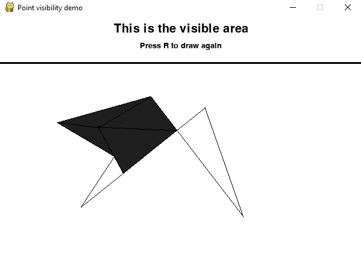

# Simulation for visibility polygon problem
You can draw one polygon at a time on the screen, select a point and view the area that is visible from that point
Implementation based on pygame.  
The scope of this repo is purely academic. The demo requires pygame<2.0.  

